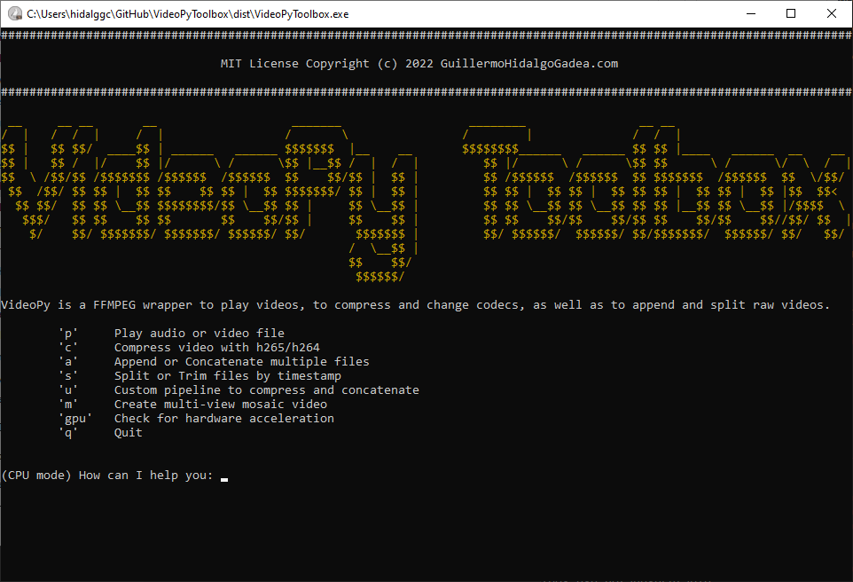

# VideoPyToolbox 

Play, compress, trim and concatenate videos in python using FFmpeg

## What it is
This Toolbox is a python wrapper for a bunch of useful ffmpeg commands to play, compress and edit videos using ffmpeg.
Many video recordings in computer vision are not optimized for conventional media players due to large uncompressed sizes or incompatible video codecs (see [here](https://gitlab.ruhr-uni-bochum.de/ikn/syncflir) for such a video recording tool). FFplay can easily open video files with several codecs and play them frame by frame.
When it comes to video compression, FFmpeg can be challenging to use over command line, specially in batch processing. This toolbox allows you to run pre-defined ffmpeg commands with a few mouse clicks in Tk interfaces and interactive keyboard inputs right from the terminal.

## How to use it
The Toolbox is built as an interactive terminal prompt to guide you step by step through the process of concatenating, compressing, spliting and playing videos. You can either use the `VideoPyToolbox.py` script in your IDE, or run it from the terminal. You can find a compiled version of VideoPyToolbox [here](https://gitlab.ruhr-uni-bochum.de/ikn/syncflir/-/blob/master/PostProcessing/VideoPyToolbox.exe).

## Features
The video player allows to stream up to 9 files at the same time, for example to check for synchronizity. Video compression is set to `hevc/h.265`, but could be expanded in future releases. GPU mode uses hardware acceleration for encoding with `hevc_nvenc`. The trim/split function to extract video snippets between timestamps needs to re-encode the video with `h.265 cfr 0` or `hevc_nvenc cq 0` respectively, to achieve "frame-accurate" splits. Lossless splits are not accurate enough if the chosen timestamp does not happen to contain a keyframe, which can result in timeshifts of up to several seconds (depending on framerate).

## Next release
* enhanced batch processing for split from multiple directories
* choice between losless and re-encoded trim/split
* choose from wider variety of compression codecs
* play audio from video with waveform and timestamp
* create mosaic video
* tbd
